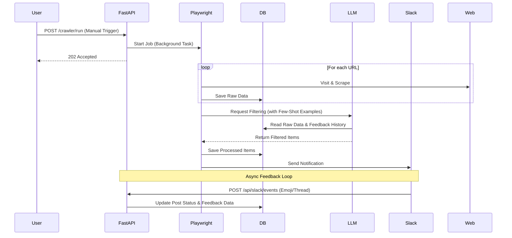

# 상세 설계서 (Bundle C)

## 1. 컴포넌트 설계 (Frontend)
Atomic Design 패턴을 변형하여 실용적으로 구성합니다.

### 1.1 Layout Components
*   `AppLayout`: Sidebar(Navigation) + Main Content Area
*   `Sidebar`: Navigation Menu (Home, Config, Dashboard)
*   `Header`: Page Title, User Profile, Global Actions

### 1.2 Common Components (UI Kit - Shadcn)
*   `Button`, `Input`, `Card`, `Dialog`, `Toast`
*   `CodeEditor`: 설정값 입력을 위한 Monaco Editor 래퍼
*   `TerminalView`: 로그 출력을 위한 터미널 스타일 뷰

### 1.3 Feature Components
*   **Config:**
    *   `ConfigForm`: 설정 입력 폼 (IDE Style)
    *   `ScheduleSelector`: Cron 스케줄 설정 UI
*   **Dashboard:**
    *   `TrendChart`: Recharts 기반 라인/바 차트
    *   `PostList`: 날짜별 게시글 목록 (Tree View)
    *   `PostDetail`: 선택된 게시글 상세 및 반응 뷰 (Markdown Viewer 포함)

## 2. API 설계 (Backend)

### 2.1 Configuration (`/api/config`)
*   `GET /`: 현재 설정 조회
*   `POST /`: 설정 업데이트 (Target URLs, Schedule, Prompt 등)

### 2.2 Crawler (`/api/crawler`)
*   `POST /run`: 크롤링 수동 실행 트리거
*   `GET /status`: 현재 실행 상태 조회 (Running/Idle)
*   `GET /logs`: 실행 로그 스트림 (WebSocket or Polling)

### 2.3 Posts (`/api/posts`)
*   `GET /`: 수집/필터링된 게시글 목록 조회 (날짜 필터)
*   `GET /{id}`: 게시글 상세 조회
*   `GET /stats`: 대시보드용 통계 데이터 (Trend, Top 10)

### 2.4 Slack Events (`/api/slack/events`)
*   `POST /`: Slack Event Subscription을 위한 Webhook 엔드포인트.
    *   **처리 이벤트:**
        *   `reaction_added`: 이모지 반응 수집 -> DB 업데이트 (피드백 점수 반영).
        *   `message.replied`: 스레드 댓글 수집 -> DB 업데이트 (추가 워크플로우 트리거 가능).
    *   **검증:** Slack Request Signing 검증 필요.

## 3. API Flow Diagrams

### 3.1 크롤링 및 필터링 파이프라인

## 4. Feature List (개발 우선순위)

### P0: 핵심 기능 (MVP)
1.  **기본 UI 프레임워크:** Next.js + Shadcn + Sidebar Layout.
2.  **설정 관리:** 타겟 URL, 프롬프트 저장/조회 API.
3.  **수동 크롤링:** Playwright 연동 및 텍스트 수집.
4.  **AI 필터링:** OpenAI API 연동 및 기본 필터링.
5.  **Slack 알림:** Webhook 연동.

### P1: 고도화
1.  **대시보드 (VS Code Style):** Split View, Post List, Detail View.
2.  **피드백 루프:** Slack 이모지 수집 및 DB 저장.
3.  **Few-Shot Learning:** 필터링 시 피드백 데이터 반영.
4.  **주기적 실행:** Scheduler 구현.

### P2: 부가 기능
1.  **통계 그래프:** Recharts 연동.
2.  **로그 뷰어:** 실시간 로그 스트리밍.
3.  **로그인:** 간단한 인증 시스템.
